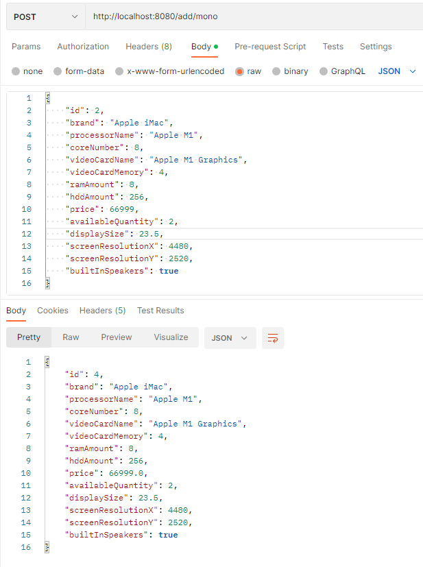

# REST service Computer shop

This is RESTful computer shop service using Spring Boot.

The service allows to work with three types of computers
* Desktop
* Laptop
* Mono block

Data storage is implemented using the H2 database, the data disappears after each restart of the server

Below is an example of working with the service

* Adding a desktop computer to the store database:

* Adding a laptop to the store database:

* Adding a mono block computer to the store database:

* The user can also get all computers of one type(Desktops, Laptops, etc)
To do this, it is necessary to transfer the type of the required device as a path variable. 
Example:

:

* When making a purchase, the client receives a receipt with a description 
of the product and the price. The number of goods of this type decreases in the warehouse by one unit

